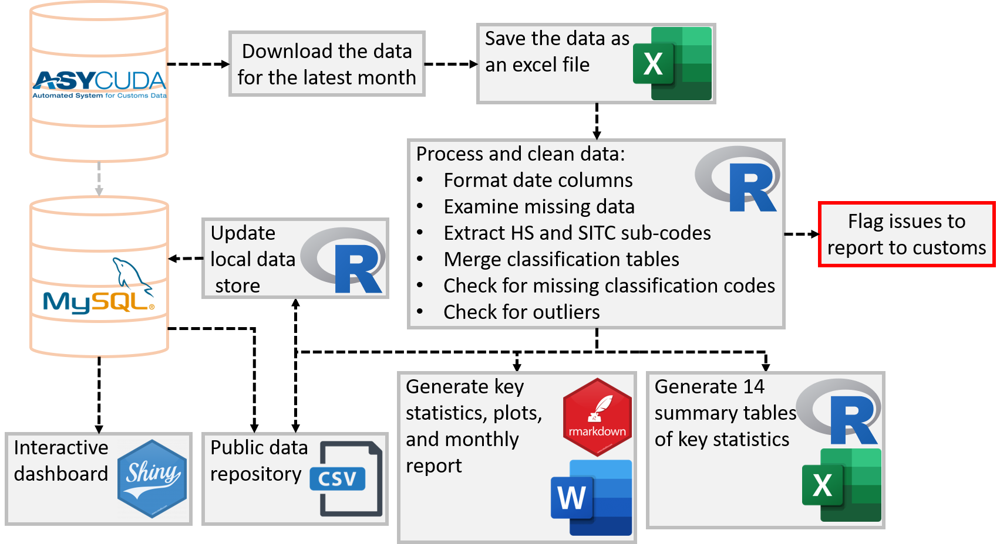

 

             

# A Reproducible Analytical Pipeline for the Vanuatu National Statistics Office International Arrival Statistics reporting&nbsp;

Producing official statistics for publications is a key function of many teams across Government. It’s a time consuming and meticulous process to ensure that statistics are accurate and timely. With open source software becoming more widely used, there’s now a range of tools and techniques that can be used to reduce production time, whilst maintaining and even improving the quality of the publications.  

> The Reproducible Analytical Pipeline (RAP) is an alternative production methodology for automating the bulk of steps involved in creating a statistical report. 

To know more about the Vanautu National Statistics Office. Click [Here](https://vnso.gov.vu)

The Vanuatu National Statistics Office collects, compiles and disseminates detailed international arrival statistics. 
All International arrival and departure statistics by air provided in this report are sourced from the Passenger processing module within ASYCUDA World System and also completed Arrival and Departure cards from the Department of Customs. Cruise ship figures are also supplied by the Department of Customs through the Passenger processing module.

> Tourism is an important part of the Vanuatu economy, and a key sector within a growing services economy. Globally, on average tourism directly contributes 4.4% of GDP, 6.9% of employment and 21.5% of service related exports to Organisation of Economic Cooperation and Development countries. Global tourism has steadily expanded for over six decades.

To know more about International Arrival Statistics in Vanuatu. Click [Here](https://vnso.gov.vu/index.php/en/statistics-by-topic/tourism)

## List of Resources
- [Introduction to Reproducible Analytical Pipelines](https://ukgovdatascience.github.io/rap_companion/)
    * Free RAP Course [here](https://www.udemy.com/course/reproducible-analytical-pipelines/) 
    * Blog on RAP [here](https://dataingovernment.blog.gov.uk/2017/03/27/reproducible-analytical-pipeline/)
    * Video of Reproducible analysis using R [here](https://www.youtube.com/watch?v=qvPDE4ppAns) 

- [Introduction to International Visitors Arrival Statistics](https://www.spc.int)
    * World Tourism Data [here](https://data.worldbank.org/indicator/ST.INT.ARVL?locations=VU)
    * United Nations Tourism Statistics [here](https://www.unwto.org/unwto-tourism-dashboard)
    * Video [here](https://www.youtube.com/watch?v=BZO9ieVZAoY)

